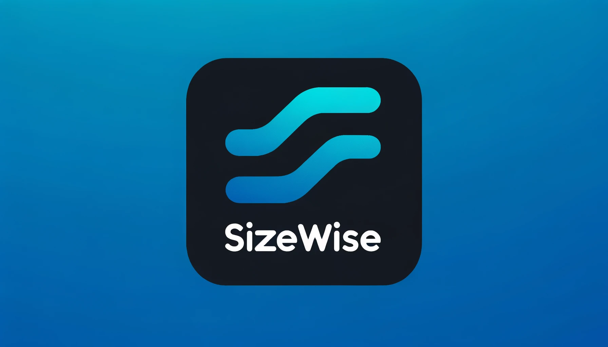

# SizeWise



### A dynamic image serving and resizing server written in Go

SizeWise is a dynamic image serving and resizing server written in Go. It allows users to request images stored in various storage solutions (e.g., AWS S3, local storage) and dynamically resizes these images based on the request parameters. This is particularly useful for web applications that require images of different sizes for responsive design without the need to manually generate and store multiple versions of each image.

## Features

- **Dynamic Image Resizing:** Automatically resize images on-the-fly based on the request parameters.
- **Multiple Storage Backends:** Support for cloud storage (such as AWS S3) and local filesystem storage.
- **Caching Resized Images:** Save resized images back to the selected storage for future requests, reducing processing time and bandwidth.
- **Easy Configuration:** Simple JSON configuration to manage storage options and server settings.

## Usage

Request images by accessing the server with the following pattern:

```
http://cache.sizewise.run/{storage}/{modifier}/{path...}
```

- `{storage}`: The `id` of the storage defined in your `sizewiserc.json`.
- `{modifier}`: The desired width of the image, prefixed with `w`. For example, `w200` for a width of 200 pixels.
- `{path...}`: The path to the original image within the specified storage.

Example request:

```
http://cache.sizewise.run/cloud/w200/images/myImage.jpeg
```

If an image named `myImage-w200.jpeg` exists in the specified storage, it will be returned. Otherwise, Sizewise will resize `myImage.jpeg` to the specified width, return the resized image to the user, and save the new image back to the storage.

### Modifiers

- `w100`: The base image width. Use only this to keep aspect ration
- `h100`: The base image height Use only this to keep aspect ration
- `x2`: A size multiplier

The x modifier can help you create srcset easily.  
In the following example a base image of 200px width will be served. An image of 400px and 600px will also be provided in the srcset using x2 and x3

```

```

## Getting Started

### Prerequisites

- Access to the storage solution(s) you plan to use (e.g., AWS S3 bucket details)
- libvips for resizing the image on linux & macOS (https://www.libvips.org/install.html)

### Installation

User official docker image or download the latest compiled binary for your platform (macOS or Linux) from the [Releases](https://github.com/georgesofianosgr/sizewise/releases) page.

Docker:

```sh
docker run -p 8080:8080 -v sizewiserc.json:/sizewiserc.json sizewise:latest
```

For Linux:

```sh
wget https://github.com/georgesofianosgr/sizewise/releases/download/v1.0/sizewise-linux-amd64 -o sizewise
chmod +x sizewise
```

For macOS:

```sh
curl -L https://github.com/georgesofianosgr/sizewise/releases/download/v1.0/sizewise-macos-amd64 -o sizewise
chmod +x sizewise
```

Or clone the repository and build the server:

```sh
git clone https://github.com/yourusername/sizewise.git
cd sizewise
go build
```

### Configuration

Create a configuration file named sizewiserc.json and place it in your home directory, or another directory of your choosing. Specify the path to your configuration file using the -config flag when starting the server.

Example `sizewiserc.json`:

```json
{
  "version": 1.0,
  "storages": [
    {
      "id": "cloud", // Required for accessing storage from url
      "type": "s3", // Required, can be local or s3
      "accessKey": "BAIDVAKZR5MQCAHDX6ZO", // Required for s3 storage
      "secretKey": "sdkajOSKJALSKJdksjaksjaksjaOAKSJDKJASLA", // Required for s3 storage
      "bucket": "my-bucket", // Required for s3 storage
      "region": "eu-west-1", // Required for s3 storage
      "basePath": "dir/", // Required, the base path for images
      "cache": true // Optional, default true, set false to opt out from writing resized images
    },
    {
      "id": "host",
      "type": "local",
      "basePath": "/home/ubuntu/image_store",
      "cache": false
    }
  ]
}
```

This configuration supports multiple storage definitions. Each storage has an id that is used in the request URL to specify where to fetch the image from.

### Running the Server

Start the server with the `-serve` flag:

```sh
sizewise -serve
```

If you have your configuration file in a custom location use --config:

```sh
sizewise -serve --config=/path/to/your/config/sizewiserc.json
```

## Notes

Sizewise is using [bimg](https://github.com/h2non/bimg) for resizing which through libvips can read `JPEG`, `PNG`, `WEBP` natively, and optionally `TIFF`, `PDF`, `GIF` and `SVG` formats if libvips@8.3+ is compiled with proper library bindings

## Contributing

Contributions are welcome! Please feel free to submit a pull request.

## License

[MIT License](LICENSE) - see the LICENSE file for details.

```

```
